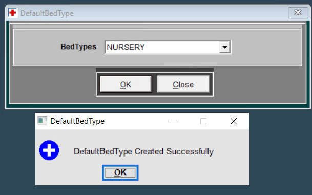
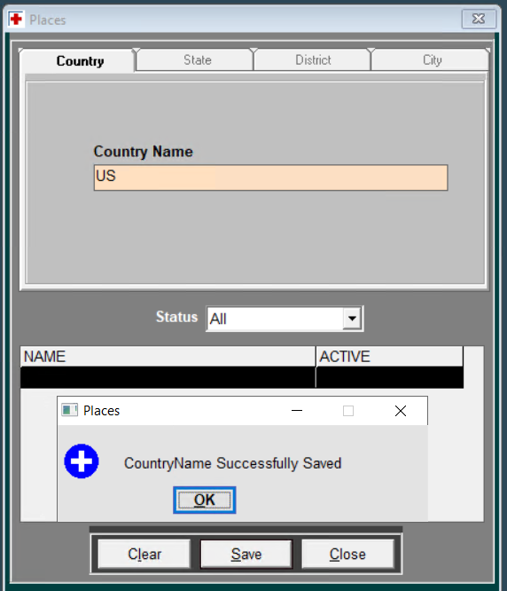
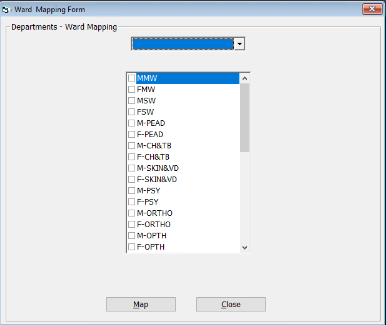
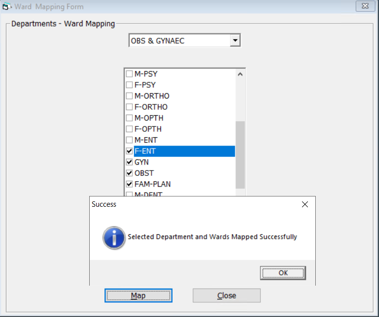
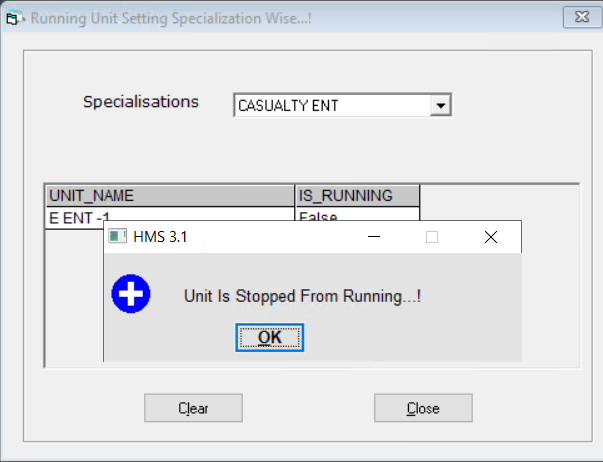
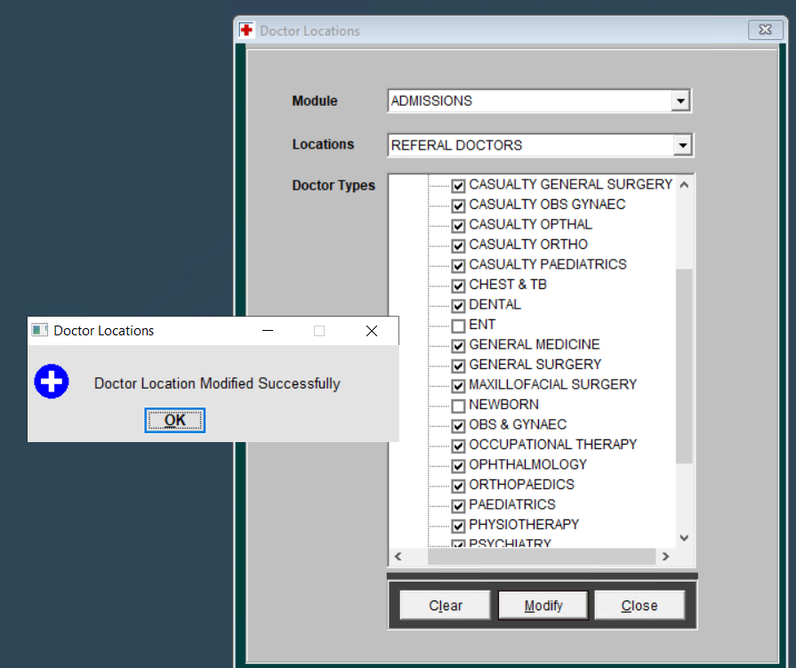

# **HMS**

# General Console

## **1) File**

### a) Categories

### i) CategoryDetails

- `Open`

```sql
-- SP
EXEC S_SEC_ReturnPermissions 1,1,-1
-- Parameter
@HOSPITALID   AS NUMERIC  ,
@USERID   AS NUMERIC ,
@MENUID   AS NUMERIC

-- SP
EXECUTE S_ADM_POP_CategoryDetails -1,0,1
-- Parameter
@Fk_CategoryID as numeric=-1,
@IsDeleted as numeric,
@HospID as numeric

-- SP
EXECUTE S_ADM_CategoryMaster -1,0,1
-- Parameter
@Pk_CategoryID as numeric=-1,
@IsDeleted as int =2,
@HospID as numeric=1

-- SP
EXECUTE S_ADM_POP_CategoryDetails 315,0,1
-- Parameter
@Fk_CategoryID as numeric=-1,
@IsDeleted as numeric,
@HospID as numeric
```


- Select `CategoryName`

```sql
-- SP
EXECUTE S_ADM_POP_CategoryDetails 270,0,1
```


- Select `All` in State

```sql
-- SP
EXECUTE S_ADM_POP_CategoryDetails 318,2,1
```

- Selct the `ctegory`

```sql
-- SP
EXECUTE S_ADM_POP_CategoryMasterDetails 2173,1
-- Parameter
@Pk_CategoryDetailID as numeric=0,
@HospID as numeric

```

- Un-check the any one `ACTIVE` column, press `Ok` & `Enter Region`

```sql
-- SP
EXECUTE S_ADM_UPDATE_CategoryDetails 1,2173,'CASUAL',1
-- Parameter
@IsDeleted as int,
@IntCategoryDetailID as numeric,
@Reason as varchar(50),
@HospID as numeric

-- SP
EXECUTE S_ADM_POP_CategoryDetails 315,0,1
```

- Again Select the Category & click on `Modify` button

```sql
-- SP
EXECUTE S_ADM_CheckCategoryNameCanModify 2242,1
-- Parameter
@Pk_CategoryDetailID as numeric,
@Hospid as numeric
```


### i) PatientDetails

- `Open`

```sql
-- SP
EXEC S_SEC_ReturnPermissions 1,1,-1
Execute S_ADM_CategoryMasterPatientTypeDetails 0,1,1
-- Parameter
@Operation as int,
@Fk_CategoryID as numeric,
@Hospid as Numeric

-- SP
Execute S_PatientCategoryTypeDetails 2313,2,1
-- Parameter
@Fk_PatientTypeID  as  numeric,
@IsDeleted   as  smallint=2,
@Hospid      as numeric

```


- Select `PatientDetail`

```sql
-- SP
Execute S_PatientCategoryTypeDetails 2208,2,1
```

- Select any column

```sql
-- SP
Execute S_PatientCategoryTypeDetails 2208,0,1
```

- Select any column & press `Modify` btn

```sql
-- SP
Execute S_ADM_PatientTypeDetailsUniqueName 2208, 'CAMP',1
-- SP
Execute S_MAS_PatientTypeDetails 1,2208,2208,'CAMP',NULL,NULL,NULL,NULL,NULL ,NULL,NULL,NULL,'', NULL,NULL,NULL,NULL,NULL,1 ,0,'',NULL,NULL,1
-- SP
Execute S_PatientCategoryTypeDetails 2208,0,1
```


### b) Corporates

- `Open`

```sql
-- SP
EXEC S_SEC_ReturnPermissions 1,1,-1
-- SP
EXECUTE S_Corporates 0,2,1

Select Getdate() as SystemDate
```


- Select `Corporate Name` & change any field value


- Presss `Modify` btn

```sql
Select Getdate() as SystemDate
-- SP
EXECUTE S_ADM_CheckCorporateExists 1,-1,''
-- Parameter
@HOSPID AS NUMERIC,
@CORPORATEID AS NUMERIC,
@CORPORATENAME AS VARCHAR(50)

-- SP
EXECUTE S_MAS_Corporate 1,9,'BTS','10/3/2008 11:10:27 AM', NULL,'WARANGAL','GM','GM','ADMIN','','',1,0,'','abc@gmail.com',1,0,NULL,NULL,'12/12/2024 10:08:08 AM'
-- Parameter
@Operation as int=0,   ---this is used for type of operation( inserting or updating)
@Pk_CorporateID as int=0,  -- this is used for updation if operation is 1 and Pk_Corporateid
    -- should be more than 0(ZeroValue)
@CorporateName as Varchar(50),
@FromDate as datetime,
@ToDate as datetime=NULL,
@Address varchar(499),     --Altered by Padma Rao on 29-OCT-2004
@ContactPerson as varchar(50),
@ConDesig as varchar(50),
@ConDept as varchar(50),
@Phone as varchar(20),
@Fax as varchar(20),
@Fk_OperatorID as int,
@isDeleted as numeric,
@Reason as varchar(50),
@Email as varchar(50),
@HospID as NUMERIC,
@RegFee as numeric,@modFromDate as datetime=null,
@modToDate as datetime=NULL,@ModCreatedDate as datetime=null

-- SP
EXECUTE S_Corporates 0,2,1
```


- Change `Status` dropdow

```sql
-- SP
EXECUTE S_Corporates 0,2,1
-- Parameter
@Pk_CorporateID as int=0,
@IsDeleted as smallint=2,
@Hospid as numeric

```

### c) ChildDefinition

- `Open`

```sql
-- SP
EXEC S_SEC_ReturnPermissions 1,1,-1
-- SP
Execute S_CAT_POP_Data 200,'AGETYPE',0,2,1
-- SP
Execute S_ADM_ChildDefination -1,2
-- Parameter
@PK_ID as numeric=-1,
@Isdeleted as numeric

```


- Click to `Modify` btn

```sql
Select Getdate() as SystemDate
-- SP
Execute S_MAS_ChildDefination 1,1,'Child Definition',3,14,805,0,'',1,1,'12/12/2024 10:16:13 AM',37
-- Parameter
@Operation  as int=0,
@PK_ID     as numeric=-1,
@TypeName as varchar(50),
@AgeFrom as numeric(9),
@AgeTo  as numeric(9),
@AgeTypeID as numeric(9),
@IsDeleted as numeric,
@Reason  as varchar(100),
@OperetorID as numeric(9),
@HOSPID  as numeric(9),
@CreatedDate as datetime,
@TerminalID as numeric(9)

```

### d) Departments

- `Open`

```sql
-- SP
EXEC S_SEC_ReturnPermissions 1,1,-1
-- SP
execute S_ADM_CategoryTypes 'MEDICALTYPE',0,1
-- SP
EXECUTE S_ADM_DepartmentTypes 0, 2,1
```


- Click on `Departments`

```sql
-- SP
EXECUTE S_ADM_Departments 0, 2,1
-- Parameter


-- SP
EXECUTE S_ADM_DepartmentTypes 0, 0,1
-- Parameter


-- SP
EXECUTE S_ADM_Departments 0, 2,1
-- Parameter


```


Select `Department Type` drop down

```sql
-- SP
EXECUTE S_POP_Department 22, 2,'',1
-- Parameter


```


Select the `Departmet` column


Change the fields value

Click on `Modify` btn

```sql
-- SP
EXECUTE S_ADM_CheckDepartmentNameExists 'CT SCAN',1, 60, 9,2
-- Parameter


-- SP
EXECUTE S_UPDATE_ADM_Departments 9, 60, 'CT SCAN', 'GROUND FLOORS', 1, 'R', 0, 1, 0, 0
-- Parameter


-- SP
EXECUTE S_POP_Department 9, 2,'',1
-- Parameter


```


- Click on `Department Type`

```sql
-- SP
EXECUTE S_ADM_DepartmentTypes 0, 2,1
-- Parameter


```


Click on `Add` btn & enter the new value


Click on `Save`

```sql
-- SP
EXECUTE S_ADM_CheckDepartmentTypeExists 'KID',1, -1,0
-- Parameter
@DepartmentTypeName  AS VARCHAR(50),
@HOSPID AS NUMERIC ,
@DepartmentTypeID as numeric,
@IsDeleted as int=2

-- SP
EXECUTE S_SAVE_AdmDepartmentTypes 'KID', 1, 811, 0, '', 1
-- Parameter
@DepartmentTypeName as varchar(50),
@Fk_OperatorID as int,
@Fk_CatDetMedicalTypeID as int,
@IsDeleted as int,
@Reason as varchar(50),
@HospID as numeric

-- SP
EXECUTE S_ADM_DepartmentTypes 0, 2,1
-- Parameter
@Pk_DepartmentTypeID as int=0,
@IsDeleted as int=2 ,
@Hospid as numeric=1

```

### e) DefaultPatientType

- `Open`

```sql
-- SP
EXEC S_SEC_ReturnPermissions 1,1,-1
-- SP
Execute S_PatientTypePatientDetails 0,0
-- SP
Execute S_GEN_DefaultPatientType -1,0,0
-- SP
Execute S_PatientTypePatientDetails 1,2177
-- SP
Execute S_GEN_DefaultPatientType -1,0,2177
```


- Select `PatientTypes`

```sql
-- SP
Execute S_PatientTypePatientDetails 1,2177
-- Parameter
@operation as numeric,
@Fk_PatientTypeID  as numeric

-- SP
Execute S_GEN_DefaultPatientType -1,0,2177
-- Parameter
@PK_DefaultID as smallint=-1,
@IsDeleted as smallint,
@Fk_PatientTypeID AS NUMERIC

```


- Click `Ok`


```sql
-- SP
Execute S_ADM_UniqueDefaultPatientType 2305,2305
-- Parameter
@Fk_PatientTypeID as numeric,
@FK_PatientDetailID as numeric

Select Getdate() as SystemDate
-- SP
Execute S_MAS_DefaultPatientType 0,0,2305,2305,1,0,'',1,37,'12/12/2024 10:49:05 AM'
-- Parameter
@Operation 	as 	int=0,
@PK_DefaultID	as	numeric(9),
@Fk_PatientTypeID	as numeric(9),
@FK_PatientDetailID	as numeric(9),
@HOSPID			as numeric(9),
@IsDeleted		as numeric,
@Reason			as varchar(100),
@OperetorID		as numeric(9),
@TerminalID		as numeric(9),
@CreatedDate		as datetime

```

### f) DefaultBedType

- `Open`

```sql
-- SP
EXEC S_SEC_ReturnPermissions 1,1,-1
-- SP
Execute S_BedtypeBedDetails 0,0
-- Parameter
@operation as numeric,
@Fk_PatientTypeID  as numeric

-- SP
Execute S_GEN_DefaultBedType -1,0,0
-- Parameter
@PK_DefaultID as smallint=-1,
@IsDeleted as smallint,
@FK_BedTypeID AS NUMERIC

```


- Change the `BedTypes` & press `Ok`



```sql
-- SP
Execute S_ADM_UniqueDefaultBedType 2276
-- Parameter
@Fk_BedTypeID as numeric

Select Getdate() as SystemDate
-- SP
Execute S_MAS_DefaultBedType 0,0,2276,'12/12/2024 10:51:45 AM','1/1/1900',1,37,1,0,''
-- Parameter
@Operation 	as 	int=0,
@PK_DefaultID	as	numeric(9),
@Fk_BedTypeID	as 	numeric(9),
@FromDate	as	datetime='1/1/1900',
@ToDate		as	datetime='1/1/1900',
@HospID		as	numeric,
@TerminalID	as	numeric,
@OperatorID	as	numeric,
@IsDeleted	as	bit,
@Reason		as	varchar(100)

```

### g) Fees

- `Open`

```sql
-- SP
EXEC S_SEC_ReturnPermissions 1,1,-1
-- SP
EXECUTE S_ADM_FeeTypeMaster -1, 0,1
-- SP
EXECUTE S_ADM_CategoryTypes 'PATIENTTYPE', 0,1
```


### I) FreeType

- Click on `FreeType`

```sql
-- SP
EXECUTE S_ADM_FeeTypeMaster -1, 2,1
```


Select any `ACTIVE`


Change the `Fee Type Name`

Click on `Modify`

```sql
-- SP
EXECUTE S_MAS_FeeTypes 1, 1, 'CASH', 1, '', 1
-- Parameter
@Operation as int=0,
@PK_FeeTypeID as numeric=-1,
@FeeTypeName as varchar(50),
@FK_OperatorID as int,
@Reason as varchar(50),
@HospID as numeric

```


### II) Registration Frees

- Click on `Registration Frees`

```sql
-- SP
EXECUTE S_ADM_FeeTypeMaster -1, 0,1
-- SP
EXECUTE S_ADM_CategoryTypes 'PATIENTTYPE', 0,1
```


Select `Patient Type`

```sql
-- SP
EXECUTE S_ADM_POP_PatientTypeList 2313,1,'12/12/2024 11:07:18 AM'
-- SP
EXECUTE S_ADM_FeeTypeDetails 2313,-1,-1, 2,1
```

Click the selected checkbox in `PatientTypeName`


Select the `Fees Type` from dropdown

Enter amount `Fee Amount`, Select `Date`

```sql
-- SP
EXECUTE S_ADM_FeeTypeDetails 2177,-1,1, 2,1
```


Select the column, modify the fields & click `Modify` btn


```sql
set implicit_transactions on
-- SP
EXECUTE S_MAS_FeeTypeDetails 1, 0, 'PRIVATE', 1, 2177, 1500, '5/24/2013 12:13:30 PM', NULL, 0, 'True', 0, 0, '', 1, 1,2177

IF @@TRANCOUNT > 0 COMMIT TRAN
```


Press `Ok`

```sql
set implicit_transactions off
-- SP
EXECUTE S_ADM_FeeTypeDetails 2177,-1,-1, 2,1
-- Parameter
@FK_CatPatTypeID		AS NUMERIC=-1,
@Fk_PatientTypeDetailID  	AS NUMERIC=-1,
@Fk_FeeTypeID 			as numeric=-1,
@IsDeleted 			as int =2,
@Hospid  			as numeric

```


- `Add`


click on `Add` btn
Select `Patient Type`

```sql
-- SP
EXECUTE S_ADM_POP_PatientTypeList 2208,1,'12/12/2024 11:21:30 AM'
-- Parameter
@Fk_PatientTypeID   AS  Numeric   ,
@HospID      AS  Numeric   ,
@PatientDate      AS  DateTime = '1/1/1900' ,
@ID       AS  Numeric = 0

-- SP
EXECUTE S_ADM_FeeTypeDetails 2208,-1,-1, 2,1
```

Select `Fees Type`

```sql
-- SP
EXECUTE S_ADM_FeeTypeDetails 2208,-1,2, 2,1

```

Enter other details & click `Save`


```sql
set implicit_transactions on
-- SP
EXECUTE S_MAS_FeeTypeDetails 0, -1, '', 2, 2208, 25000, '12/12/2024 11:24:19 AM', NULL, 0, '', 0, 0, '', 1, 1,2208
-- Parameter
@Operation as int=0,
@PK_FeeTypeDetailID as numeric=-1,
@FeeTypeDetailName as varchar(50),
@Fk_FeeTypeID as numeric,
@FK_CatPatTypeID as numeric,
@FeeAmount as numeric,
@FromDate as datetime,
@ToDate as datetime,
@IsDeleted as int,
@Reason as varchar(50),
@Reason_req as int,
@Highlight as int,
@Caption as varchar(50),
@Fk_OperatorID as int,
@HospID as numeric  ,
@Fk_PatientTypeDetailID as numeric

IF @@TRANCOUNT > 0 COMMIT TRAN
```

### h) FeeSubTypes

- `Open`

```sql
-- SP
EXEC S_SEC_ReturnPermissions 1,1,-1
-- SP
EXECUTE S_ADM_FeeTypeMaster -1, 0,1
-- Parameter
@Pk_FeeTypeID as int=-1,
@IsDeleted as int =2,
@Hospid		as numeric=-1

-- SP
EXECUTE S_DML_FeeSubTypes 3,-1,  0,'',2,1,0,0

```


- For `Add`

Select the `FeeTypeName` & enter the `FeesubTypeName`


Press `Save`

```sql
-- SP
EXECUTE S_DML_FeeSubTypes 4,0,  2,'LOAN',0,1,0,0
EXECUTE S_DML_FeeSubTypes 1,-1,2,'LOAN',0,1,37,1
```

- For `Modify`

Select the `FeeTypeName`

```sql
-- SP
EXECUTE S_DML_FeeSubTypes 3,0,  2,'0',2,1,0,0
```

Select the Column


Change the `Active` or `FeesubtypeName` & press `Modify` btn


```sql
-- SP
EXECUTE S_DML_FeeSubTypes 4,0,  2,'CREDITS',0,1,0,0
-- Parameter
@Operation   as  numeric=1,
@PK_FeeSubTypeID AS numeric=-1,
@Fk_FeeTypeID  AS numeric,
@FeeSubTypeName  AS varchar(50),
@IsDeleted  as  numeric=2,
@HospID   AS numeric,
@TerminalID  AS numeric,
@OperatorID  AS numeric

-- SP
EXECUTE S_DML_FeeSubTypes 2,2,2,'CREDITS',0,1,37,1
EXECUTE S_DML_FeeSubTypes 3,-1,  2,'',2,1,0,0


```

### i) OTMaster

- `Open`

```sql
-- SP
EXEC S_SEC_ReturnPermissions 1,1,-1
-- Parameter
@HOSPITALID   AS NUMERIC  ,
@USERID   AS NUMERIC ,
@MENUID   AS NUMERIC

-- SP
Execute S_ADM_POP_OTTypes
-- SP
Execute S_ADM_OTMaster 2,2,1
```


- For `Modify`

Select `OTType`

```SQL
-- SP
Execute S_ADM_OTMaster 1,2,1
-- Parameter
@Fk_TypeID	as numeric=-1,
@IsDeleted 	as int =2,
@HospID 	as numeric

-- SP
Execute S_ADM_OTMaster 1,2,1
-- Parameter
@Fk_TypeID	as numeric=-1,
@IsDeleted 	as int =2,
@HospID 	as numeric

```


Select Column


Modify the fields & press `Modify` btn

```sql
-- SP
Execute S_ADM_OTMasterUniqueName 14,'MINOR OT 1ST FLR',0,1,1
-- SP
Execute S_MAS_OT 1,14,'MINOR OT 1ST FLR','FIRST FLOORs', 0,0,0,'1/1/1900','1/1/1900',1,1,0,37,1
```


- For `Add`

Select OTType, Click `Add` btn, enter `Name` & `Loaction`


Press `Save` btn

```sql
-- SP
Execute S_ADM_OTMasterUniqueName -1,'Leg',0,1,1
-- Parameter
@PK_OTID  AS NUMERIC,
@OTName  as Varchar(50),
@IsDeleted  as int,
@Hospid  as numeric,
@Fk_TypeID  as numeric

-- SP
Execute S_MAS_OT 0,-1,'Leg','GROUND FLOOR', 0,0,0,'1/1/1900','1/1/1900',1,1,0,37,1
-- Parameter
@Operation 	as int=0,
@PK_OTID 	as  numeric=-1,
@OTName  	as varchar(25),
@OT_Location 	as varchar(100),
@FKUnitTypeID 	as numeric,
@OTUnitValue 	as numeric,
@OTUnitPrice 	as numeric,
@From_Date 	as datetime='1/1/1900',
@To_Date 	as datetime='1/1/1900',
@HospID 	as numeric,
@FKOperatorID 	as numeric,
@PreOTID 	as  numeric=0,
@TerminalID 	as numeric,
@FK_TypeID	AS numeric

```

### j) Places

- `Open`

```sql
-- SP
EXEC S_SEC_ReturnPermissions 1,1,-1
-- SP
execute S_Country 2
```


- Add new `Country`

Click On `Add` btn

Enter the `Country Name` & press `Save` btn



```sql
-- SP
EXECUTE S_ADM_CheckForUniqueNames 'India', 0, -1 , 1
-- SP
EXECUTE S_SAVE_Country 'US', 1
-- Parameter
@Name as varchar(50),
@OperatorId as int

```

- Add new `State`

Go to `State tab` press `Add` btn select `Country Name` & press `Save`


```sql
-- SP
EXECUTE S_ADM_CheckForUniqueNames 'abc', 1, 2 , 1
-- SP
EXECUTE S_SAVE_State 'abc', 2, 1
-- Parameter
@Name as varchar(50),
@CountryID as int,
@OperatorId as int

-- SP
EXECUTE S_StateCountryID 2, 2
```

- Add new `District`

Select `District tab`, press `Add` btn, select `Country Name`, Select `State Name`, enter the `District Name` & press `Save` btn


```sql
-- Execute when select Country Name
-- SP
EXECUTE S_StateCountryID 2, 0

-- Execute when select State Name
-- SP
EXECUTE S_DistrictStateID 4, 2
-- Execute when press Save btn
-- SP
EXECUTE S_ADM_CheckForUniqueNames 'xyz', 2, 4 , 1
-- SP
EXECUTE S_SAVE_District 'xyz', 4, 1
-- Parameter
@Name as varchar(50),
@StateID as int,
@OperatorId as int

-- Execute when press Ok
-- SP
EXECUTE S_DistrictStateID 4, 2
```

- Add new `City`

Select `City tab`, press `Add` btn, select `Country Name`, Select `State Name`, Select `District Name` enter the `City Name` & press `Save` btn


```sql
-- Execute when select
-- SP
EXECUTE S_StateCountryID 2, 0
-- SP
EXECUTE S_DistrictStateID 4, 0
-- SP
EXECUTE S_CityDistrictID 12, 2
-- Execute when press Save btn
-- SP
EXECUTE S_ADM_CheckForUniqueNames 'mnop', 3, 12 , 1
-- Parameter
@GivenName As Varchar(100),
@TableNumber As Int = 0,
-- Table Numbers As Follows --
-- 0 = Country
-- 1 = State
-- 2 = District
-- 3 = City
-- 4 = Department
-- 5 = DepartmentType
-- 6 = Module
-- 7 = Terminal
-- 8 = Area
@RelatedID As Int = -1,
@HospID  As Int


-- SP
EXECUTE S_SAVE_City 'mnop', 12, 1
-- Parameter
@Name as varchar(50),
@DistrictID as int,
@OperatorId as int

-- Execute when press Ok
-- SP
EXECUTE S_CityDistrictID 12, 2
```

- Modify `Country`

Select the Column, Change the field of `Country Name` & press `Modify` btn


```sql
-- SP
EXECUTE S_UPDATE_Country 2,'USA', 1, 0
-- Parameter
@ID as int,
@Name as varchar(50),
@OperatorId as int,
@IsDeleted as smallint

-- SP
execute S_Country 2
-- Parameter
@IsDeleted as smallint

```

- Modify `State`

Go to `State` tab, Select the all fields, Select the Column, Change the field of `State Name` & press `Modify` btn


```sql
-- SP
EXECUTE S_UPDATE_State 4,'abcd', 1, 0
-- Parameter
@ID as int,
@Name as varchar(50),
@OperatorId as int,
@IsDeleted as smallint

-- SP
EXECUTE S_StateCountryID 2, 2
-- Parameter
@CountryID as int,
@IsDeleted as smallint

```

- Modify `District`

Go to `District` tab, Select the all fields, Select the Column, Change the field of `District Name` & press `Modify` btn


```sql
-- SP
EXECUTE S_UPDATE_District 12,'xyzz', 1, 0
-- Parameter
@ID as int,
@Name as varchar(50),
@OperatorId as int,
@IsDeleted as smallint

-- SP
EXECUTE S_DistrictStateID 4, 2
-- Parameter
@StateID as int,
@IsDeleted as smallint

```

- Modify `City`

Go to `City` tab, Select the all fields, Select the Column, Change the field of `City Name` & press `Modify` btn


```sql
-- SP
EXECUTE S_UPDATE_City 2838,'mnopq', 1, 0
-- Parameter
@ID as int,
@Name as varchar(50),
@OperatorId as int,
@IsDeleted as smallint

-- SP
EXECUTE S_CityDistrictID 12, 2
-- Parameter
@DistrictID as int,
@IsDeleted as smallint

```

### k) Wards

- `Open`

```sql
-- SP
EXEC S_SEC_ReturnPermissions 1,1,-1
-- SP
Execute S_CAT_POP_Data 200 , 'BEDTYPES' , 0 , 0 , 1
-- Parameter
@FETCHTYPES  AS Integer = 100  ,
@ALIASNAME   AS Varchar(50)   ,
@CATDETAILID  AS Integer = 0   ,
@IsDELETED   AS Integer = 2  ,
@HOSPID   AS Integer

-- SP
Execute S_POP_WardDepartments 1 , 0 , 0
-- Parameter
@HospID 	As Numeric ,
@DepartmentID 	AS Numeric = 0 ,
@IsDELETED 	AS Integer = 2

-- SP
execute S_ADM_CategoryTypes 'WardTypes',0,1
Execute S_AMS_POP_BedDetails 2 , 0 , 0 , 0 , '' , 0 , 1
```


- `Add`
  Select the `Bed Type`, Select the `Word`, Enter the new `Bed Name` & press `Add`

```sql
-- SP
EXECUTE S_AMS_SAVE_Beds 100 , 2251 , 289 , 0 , 'F-ICU-B0' , 1 , '' , 1 , 37 , 2 ,2157 ,0
select * from EXECUTE S_AMS_SAVE_Beds 100 , 2251 , 289 , 0 , 'F-ICU-B0' , 1 , '' , 1 , 37 , 2 ,2157 ,0
```


- `Modify`

Select the column, change the `Field` & press `Modify` btn

```sql
-- SP
EXECUTE S_AMS_SAVE_Beds 200 , 2251 , 291 , 745 , 'F-ICU-B0' , 1 , '' , 1 , 37 , 2 ,2157 ,0
-- Parameter
 @SAVETYPE  AS Integer  = 100 , --  100 - ADD or 200 - UPDATE
 @BEDTYPEID  AS Numeric = 0  ,
 @WARDID  AS Numeric = 0  ,
 @BEDID  AS Numeric = 0  ,
 @BEDNAME   AS Varchar ( 50 )  , --  BEDS
 @OPERID  AS Numeric  ,
 @REASON  AS Varchar ( 50 ) = '' ,
 @HOSPID  AS Numeric  ,
 @TERMINALID  AS Numeric  ,
 @IsDELETED  AS Integer = 0,
--Following Two Fields Are added By Jaihind
@WardTypeId as Numeric,
@IsTemporaryBed as bit

-- SP
Execute S_AMS_POP_BedDetails 2 , 0 , 0 , 0 , '' , 0 , 1
-- Parameter
@IsDELETED     AS Integer = 2     ,
@WARDID     AS Numeric = 0     ,
@BEDTYPEID     AS Numeric = 0     ,
@BEDID     AS Numeric = 0    ,
@STATUS     AS Varchar ( 50 )  = ''   ,
@BEDCOUNT     AS Bit = 0        ,
@HOSPID     AS Integer    ,
@WARDTYPE   AS Varchar ( 50 ) = ''   ,
@IsTemp   AS SmallInt = 2  ,
@Flag    AS Numeric=0

```


### l) Wards Mapping

- `Open`

```sql
-- SP
Exec S_IP_GetDepartments 1, 1
Exec S_IP_GetDepartments 1, 0
-- Parameter
@hid as int,
@flag as bit

```



- Select from `dropdown`

```sql
select WardId from T_IP_DeptWrdMap where DeptId=3
```

- Check the `Checkbox` & press `Map` btn

```sql
select *from T_IP_DeptWrdMap
Insert into T_IP_DeptWrdMap values(3,279)
select *from T_IP_DeptWrdMap
--Uncheck the one checkbox
Delete T_IP_DeptWrdMap where DeptId=3 and WardId= 280
select *from T_IP_DeptWrdMap
```



### m) SubDepartmentMapping

- `Open`

```sql
SELECT PK_CATEGORYDETAILID , ALIASNAME FROM T_M_GENERALDETAILS WHERE FK_CATEGORYID = 285 AND ISDELETED = 0
SELECT PK_CATEGORYDETAILID , ALIASNAME FROM T_M_GENERALDETAILS WHERE FK_CATEGORYID = 285 AND ISDELETED = 0
```


- Select the dropdown

```sql
SELECT SUBSPECID FROM T_M_SUBDEPMAP WHERE ISDELETED = 0 AND MAINSPECID =2134
```

- Press `Map`

```sql
-- SP
EXEC S_GENCONS_MAPSUBDEPARTMENTS 2135,2138,1
-- Parameter
@MAINDEPT AS NUMERIC,
@SUBDEPT AS NUMERIC ,
@HOSPID AS NUMERIC

SELECT SUBSPECID FROM T_M_SUBDEPMAP WHERE ISDELETED = 0 AND MAINSPECID =2135
```

### n) Set Running Unit

- `Open`

```sql
-- SP
exec S_ADM_CategoryTypes 'SPECIALIZATION',0,1
exec S_UPDATE_Units 2327
-- Parameter
@FK_SpecializationID as numeric

```


- Change the `Specialisation`

```sql
-- SP
exec S_UPDATE_Units 2134
-- Parameter
@FK_SpecializationID as numeric

```


- Click on Column




```sql
-- SP
EXECUTE S_UnitModificationInfo 41, 0
-- Parameter
@UNITID as numeric ,
@TEMPRUN as bit

```

### o) Define Pronters

- `Open`

```sql
SELECT TERMINALNAME , PK_TERMINALID  FROM T_SEC_TERMINALMASTER WHERE ISDELETED = 0
```


- Select ` System`

```sql
select * from t_m_alternateprinters where isdeleted = 0  AND FK_TERMINALID = 38
```


- Enter all details

```sql
-- SP
EXEC S_GEN_SAVEALTERNATIVEPRINTERS 38,'Canon' , 'HP' , '2000' , 1
-- Parameter
@TERMINALID AS INT ,
@PRINTERNAME AS NVARCHAR(100) ,
@DRIVERNAME AS NVARCHAR(100) ,
@PORTNAME AS NVARCHAR(100) ,
@OPERATORID AS INT

```


## **2) Doctors**

### a) DoctorDetails

- `Open`

```sql
-- SP
EXEC S_SEC_ReturnPermissions 1,1,-1
exec S_Doctors -1, 0,1
exec S_ADM_CategoryTypes 'SPECIALIZATION',0,1
exec S_ADM_CategoryTypes 'REFDOCTORS',0,1
-- SP
exec S_POP_Department -1,0,'',1
-- Parameter
@Fk_DepartmentTypeID as numeric=-1,
@IsDeleted as int=2,
@DepartmentName as VArchar(50)='',
@HospID as numeric

```


- For `Modify`

Click on any Column

```sql
-- SP
exec S_Doctors 127,0,1
exec S_Doctors 127,0,1
```


Chnage the any fields


```sql
-- SP
exec S_Doctors 127,0,1
Execute S_MAS_Doctors 1,127,'CASUALTY DENTAL','MBBS','1','1','','','','abc@gmail.com',1,'','1',0,133,2134,2165,37,0
exec S_Doctors -1, 2,1
exec S_Doctors -1, 0,1
exec S_Doctors -1, 0,1
```

- For `Add` new

Click on `Add` btn, Enter value in fields & press `Save`

```sql
-- SP
Execute S_MAS_Doctors 0,-1,'MRITUNJAY','Nursing','1234','1','','','','',1,'','1',0,133,2202,2166,37,0
-- Parameter
@Operation   as int=0,
@Pk_DoctorID   as int=-1,
@DoctorName   as varchar(50),
@Qualification   as varchar(50),
@MLCNo    as varchar(50),
@Address   as varchar(199),
@Mobile   as varchar(50),
@Phone    as varchar(50),
@Fax    as varchar(50),
@Email    as varchar(50),
@Fk_OperatorID   as int,
@Reason   as varchar(50),
@HospID   as numeric,
@PreDoctorID   as numeric,
@FK_DepartmentID  as numeric,
@FK_SpecializationID  as numeric,
@Fk_DoctorTypeID  as numeric,
@Fk_TerminalID   as numeric,
@TobeReported  as numeric

-- SP
exec S_Doctors -1, 2,1
-- Parameter
@Pk_DoctorID as int = -1,
@IsDeleted as smallint=2,
@HospID as numeric

-- SP
exec S_Doctors -1, 2,1
-- Parameter
@Pk_DoctorID as int = -1,
@IsDeleted as smallint=2,
@HospID as numeric

-- SP
exec S_Doctors -1, 2,1
-- Parameter
@Pk_DoctorID as int = -1,
@IsDeleted as smallint=2,
@HospID as numeric

```


## **3) Formats**

### a) Bill Formats

- `Open`

```sql
-- SP
EXEC S_SEC_ReturnPermissions 1,1,-1
-- SP
Exec S_IPB_POP_BillAndFeeTypes 1
```


```sql
--Select Fee Type
-- SP
Exec S_IPB_POP_BillFormats 1,1, 1
-- Parameter
@BILLTYPEID   AS NUMERIC  ,
@FEETYPEID   AS NUMERIC  ,
@HOSPID    AS NUMERIC

```

- Press `Save` btn

```sql
Select Getdate() as SystemDate
-- SP
Exec S_IPB_SAVE_BillFormats 100,1,1,'M','K','12',101,'11/12/2003','12/12/2024 1:52:04 PM',1,37,1,-1
-- Parameter
@SAVETYPE  AS  INTEGER  ,
@BILLTYPEID  AS NUMERIC  ,
@FEETYPEID  AS  NUMERIC  ,
@PREFIX   AS VARCHAR(20) ,
@SUFFIX   AS VARCHAR(20) ,
@FEECODE  AS VARCHAR(20) ,
@SLNO   AS NUMERIC  ,
@FROMDATE  AS DATETIME ,
@TODATE   AS DATETIME ,
@OPERID   AS  NUMERIC  ,
@TERMID   AS  NUMERIC  ,
@HOSPID   AS  NUMERIC  ,
@PBFID   AS NUMERIC = -1

```


### b) Receipt Formats

- `Open`

```sql
-- SP
EXEC S_SEC_ReturnPermissions 1,1,-1
-- SP
Exec S_IPB_POP_BillAndFeeTypes 1
-- Parameter
@HOSPID 	as Numeric

```


```sql
-- Select Billing Type
-- SP
Exec S_AMS_POP_RecieptFormats 200,1,0,0,1
-- Select Receipt Type
-- SP
Exec S_AMS_POP_TransactionTypesForReceipt 100,1, 1
-- Parameter
@Flag			as 	Numeric,
@ReceiptID 		AS 	NUMERIC,
@HOSPID 		AS	NUMERIC

-- SP
Exec S_OPB_POP_PaymentModes 1
-- Parameter
@HospitalID as numeric

-- Select Payment Mode
-- SP
Exec S_AMS_POP_RecieptFormats 100,1,1,1,1
-- Parameter
@Flag			as 	Numeric ,
@BillTypeID 		AS 	NUMERIC ,
@TransactionTypeID	AS 	NUMERIC ,
@PaymentModeID		AS	NUMERIC ,
@HOSPID 		AS	NUMERIC


-- Click on Save btn
-- SP
Exec S_AMS_POP_RecieptFormats 100,1,1,1,1
-- SP
Exec S_AMS_SAVE_RecieptFormats 1,1,1,'M','K',7,'12/12/2024 4:23:25 PM','12/12/2024 1:57:55 PM',1,37,1,0
-- Parameter
@BillTypeID		AS	NUMERIC 	,
@PaymentModeID		AS	NUMERIC 	,
@TranTypeID		AS 	NUMERIC		,
@Prefix			AS	VARCHAR(10)	,
@Suffix			AS	VARCHAR(10)	,
@SerialNo		AS	VARCHAR(10)	,
@FromDate		AS	DATETIME	,
@CreatedDate		AS	DATETIME	,
@OperID			AS 	NUMERIC		,
@TermID			AS 	NUMERIC		,
@HospID			AS 	NUMERIC		,
@ReceiptFormatID 	AS 	NUMERIC = 0


```


### c) OP Specialization Notations

- `Open`

```sql
-- SP
exec S_ADM_CategoryTypes 'SPECIALIZATION',0,
```


```sql
-- Select Specialization
-- SP
exec S_POP_SPECNotations 2134, 1
-- Parameter
@SpecID	AS numeric ,
@HOSPID		AS smallint

-- Save
-- SP
exec S_Set_SPECNotations 2134, 'CAS',1
-- Parameter
@SPECID as numeric ,
@NOTSTR as varchar(3) ,
@HOSPID AS SMALLINT

```


## **4) Locations**

### a) Department Locations

- `Open`

```sql
-- SP
EXEC S_SEC_ReturnPermissions 1,1,-1
-- SP
EXECUTE S_ADM_ModuleMaster -1, 0, 1
-- Parameter
@ModuleID   As Integer = -1 ,
@IsDeleted    As Integer = -1 ,
@HOSPID AS Integer

-- SP
EXECUTE S_ADM_DepartmentLocations -1, 55, 1
-- SP
EXECUTE S_ADM_AllDepartments
-- Parameter


```


Change the `Modules Available`

```sql
-- SP
EXECUTE S_ADM_DepartmentLocations -1, 89, 1
-- Parameter
@LocationID	As Int = -1,
@ModuleID	As Int = -1,
@HospID		As Int
```


### b) Service Locations

- `Open`

```sql
-- SP
EXEC S_SEC_ReturnPermissions 1,1,-1
-- SP
EXECUTE S_SEC_ModuleMaster 0, 0,1

-- SP
EXECUTE S_ADM_ServiceMaster 0,-1,1, 0, -1, -1, -1
-- Parameter
@IsDeleted   	As Int = -1,
@ServiceID	As Int = -1,
@HospID		As Int,
@ParentItems	As Bit = 0,
@ParentID	As Int = -1,
@DependentOnly	As Int = -1,
@WithoutSrvID	As Int = -1

-- SP
EXECUTE S_ADM_ServiceDetails 81, 0, -1, 1
-- Parameter
@ServiceTypeID		As Int,
@IsDeleted		As Int = -1,
@ServiceDetailID	As Int = -1,
@HospID			As Int,
@DepartmentID		As Int = -1


```


```sql
-- Select `Modules Available`
-- SP
EXECUTE S_ADM_ServiceLocations -1, 96, 1

-- Select `Location Name`
-- SP
EXECUTE S_ADM_ServiceItemLocations 2
-- Parameter
@LocationID  As Int

-- Save btn click
-- SP
EXECUTE S_DELETE_DML_ChildLocations 2
-- Parameter
@LocationID As Int

-- SP
EXECUTE S_DML_ServiceLocations 58, 2, '', 1, 37
-- Parameter
@ModuleID	As Int,
@LocationID	As Int = -1,
@LocationName	As Varchar(100),
@HospID 	As Int,
@TerminalID	As Int

-- SP
EXECUTE S_DML_ServiceItemLocations 2,96,126
-- Parameter
@LocationID 	As Int,
@ServiceTypeID 	As Int,
@ServiceItemID	As Int


-- Ok btn press
-- SP
EXECUTE S_ADM_ServiceLocations -1, 58, 1
-- Parameter
@LocationID	As Int = -1,
@ModuleID	As Int = -1,
@HospID		As Int

```


### c) DoctorLocations

- `Open`

```sql
-- SP
EXEC S_SEC_ReturnPermissions 1,1,-1
-- SP
exec S_ADM_POP_Locations 1
-- Parameter
@HospitalID as numeric,
@LocationName as varchar(50)=''

-- SP
exec S_ADM_CategoryTypes 'REFDOCTORS',0,1
exec S_ADM_POP_LocationDoctorTypes  1,0,2165,1
-- SP
EXECUTE S_SEC_ModuleMaster 0, 0,1
-- Parameter
@ModuleID   As numeric = -1,
@IsDeleted    As numeric = -1  ,
 @HospId as numeric

```


```sql
-- Select Module
-- SP
Exec S_ADM_POP_ModuleLevelDoctorLocations 55,1

-- Select Locations
-- SP
exec S_ADM_POP_LocationDoctorTypes  0,34,0,1
-- Parameter
@Operation as numeric=0,
@LocationID  as numeric,
@DoctorTypeID as numeric,
@Hospid  as numeric

-- Click to Modify (new check & remove one check box)
-- SP
exec S_ADM_SAVE_DML_DoctorLocations 300,34,0,'',1,1,37,0,0
-- Parameter
@SAVETYPE     AS Smallint = 100 ,
@LOCATIONID     AS Numeric = 0  ,
@MODULEID     AS Numeric  ,
@LOCATIONNAME    AS Varchar ( 50 )  ,
@HOSPID     AS Numeric  ,
@OPERID     AS Numeric  ,
@TERMINALID    AS Numeric  ,
@DOCTORTYPEID    AS Numeric = 0  ,
@DOCTORID     AS Numeric = 0

-- SP
Exec S_ADM_POP_ModuleLevelDoctorLocations 55,1
-- Parameter
@ModuleID as numeric=-1,
@HospID as numeric

```



### d) HRLocations

- `Open`

```sql
-- SP
EXEC S_SEC_ReturnPermissions 1,1,-1
-- SP
Execute S_ET_POP_Modules 1
-- Parameter
@HospId	AS	Numeric

-- SP
execute S_ET_POP_DeptNames 1
-- Parameter
@HospID		As Int

-- SP
EXECUTE S_ET_SAVE_DesignationsOnDept 313,1
-- Parameter
@deptid as numeric,
@Hospid as numeric

-- SP
EXECUTE S_ET_POP_EMP_OnDesignation 1749,351,1
-- Parameter
@desigid as numeric	,
@DEPTID	AS NUMERIC	,
@Hospid as numeric

```


```sql
-- Select Modules
-- SP
EXECUTE S_ET_SAVE_LocModuleDetails 89,1
-- Parameter
 @Modid as numeric,
 @Hospid as numeric

-- Select Location Name
-- SP
EXECUTE S_ET_POP_EMP_OnLocation  1,16,1
-- Parameter
@FETCHTYPE	AS INTEGER ,
@Locid 		as numeric	,
@Hospid 		as numeric

-- Click Modify
-- SP
Execute S_ET_DELETE_LocationMapping  16
-- Parameter
@LOCID as numeric

-- SP
Execute S_ET_SAVE_LocationDetails  16, 351,1749,'FHMC/111222122'
-- Parameter
@HRLocationId	AS 	numeric,
@DeptId		AS	Numeric	,
@DesignationId	AS	Numeric	,
@EmployeeId	AS	varchar(50)

-- SP
Execute S_ET_SAVE_LocationDetails  16, 351,1808,'FHMC/12113'
-- Parameter
@HRLocationId	AS 	numeric,
@DeptId		AS	Numeric	,
@DesignationId	AS	Numeric	,
@EmployeeId	AS	varchar(50)

```


## **5) Old Patient Validity**

### a) Old Patient Consultantion Validation Master

- `Open`

```sql
-- SP
exec S_ADM_CategoryTypes 'SPECIALIZATION',0,1
```


```sql
-- Select Specialisation
-- SP
exec S_GADM_Pop_OldPAtValiditydays 2134,1
-- Parameter
@speid as integer,
@hosid as integer

-- Enter Date & press Add btn
-- SP
exec s_gadm_save_oldpatduration 5-03-2025,2134,1,37,1,0,0
-- Parameter
@duration as integer,
@specid as integer,
@hospid as numeric,
@terminalid as numeric,
@operatorid as numeric,
@isdeleted as bit,
@action as integer

-- SP
select * from exec s_gadm_save_oldpatduration 5-03-2025,2134,1,37,1,0,0
-- Parameter
@duration as integer,
@specid as integer,
@hospid as numeric,
@terminalid as numeric,
@operatorid as numeric,
@isdeleted as bit,
@action as integer

```


## **6) Units**

### a) Form1

- `Open`

```sql
-- SP
exec S_ADM_CategoryTypes 'SPECIALIZATION',0,1
-- Parameter
@CategoryType as varchar(50),
@IsDeleted as int,
@HOSPID AS NUMERIC=1 -- DEFAULT VALUE IS SET TO VOID RUNTIME ERROR

```


```sql
-- Select Specialization
-- SP
exec s_adm_pop_units 2134
-- Parameter
@specid as int

-- Enter unit & press Add btn
-- SP
exec s_adm_save_unit '20',2134,1
-- Parameter
@uni as varchar(50),
@id as integer,
@isrun as integer

```


- Make it active or Deactive

Select the Coloum, entert `Unit`, click `checkbox` & press `Add` btn

```sql
-- SP
exec s_adm_save_unit '30',2134,1
-- Parameter
@uni as varchar(50),
@id as integer,
@isrun as integer

```


